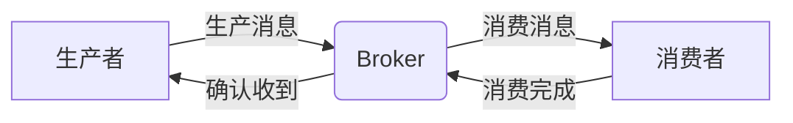

# 源码阅读
## Spring
### 1. 启动流程

主要的启动流程就是：首先主类启动，其启动实质上是创建一个新的`SpringApplication`，并启动之。

#### 1.1. 主类启动

run启动：

```java
@SpringBootApplication
public class PayEurekaApplication {
    public static void main(String[] args) {
        SpringApplication.run(PayEurekaApplication.class, args);
    }
}
```

`run()`方法是`SpringApplication`中的一组方法，首先调用的是这个方法，在内部将主类装到数组中，继续调用另一个。

```java
public static ConfigurableApplicationContext run(Class<?> primarySource, String... args) {
	return run(new Class<?>[] { primarySource }, args);
}

public static ConfigurableApplicationContext run(Class<?>[] primarySources, String[] args) {
	return new SpringApplication(primarySources).run(args);
}
```

#### 1.2. 创建`SpringApplication`

创建的过程，也是嵌套的，调用了多个构造方法。总结起来，创建过程主要是分析应用类型（Servlet），然后获取各种初始化类的实例并设置到`SpringApplication`的内部列表中，如启动注册初始化类、应用上下文初始化类、应用监听器类等。最后将主类设置为启动类

```java
public SpringApplication(Class<?>... primarySources) {
	this(null, primarySources);
}

public SpringApplication(ResourceLoader resourceLoader, Class<?>... primarySources) {
    // 默认是没有加载器的
	this.resourceLoader = resourceLoader;
    // 断言主类非空，并且装入LinkedHashSet中
	Assert.notNull(primarySources, "PrimarySources must not be null");
	this.primarySources = new LinkedHashSet<>(Arrays.asList(primarySources));
    // 获取Web应用类型，一般是Servlet
	this.webApplicationType = WebApplicationType.deduceFromClasspath();
    // 获取启动注册初始化类的实例
	this.bootstrapRegistryInitializers = new ArrayList<>(
			getSpringFactoriesInstances(BootstrapRegistryInitializer.class));
    // 获取应用上下文初始化类的实例并设置到SpringApplication的初始化实例列表中
	setInitializers((Collection) getSpringFactoriesInstances(ApplicationContextInitializer.class));
    // 获取应用监听器类的实例并设置到监听器列表中
	setListeners((Collection) getSpringFactoriesInstances(ApplicationListener.class));
    // 设置主类为启动类
	this.mainApplicationClass = deduceMainApplicationClass();
}
```

该方法内部调用了`getSpringFactoriesInstances()`来加载启动注册初始化类的实例，这个方法进一步调用了`SpringFactoriesLoader.forDefaultResourceLocation()`来获取对应类的工厂加载器，然后通过`load()`执行加载。获取及加载的过程见[3. `SpringFactoriesLoader`](#3. `SpringFactoriesLoader`)

```java
private <T> List<T> getSpringFactoriesInstances(Class<T> type, ArgumentResolver argumentResolver) {
	return SpringFactoriesLoader.forDefaultResourceLocation(getClassLoader()).load(type, argumentResolver);
}
```

#### 1.3. 启动`SpringApplication`

执行`run()`的过程：

```java
/**
 * Run the Spring application, creating and refreshing a new
 * {@link ApplicationContext}.
 * @param args the application arguments (usually passed from a Java main method)
 * @return a running {@link ApplicationContext}
 */
public ConfigurableApplicationContext run(String... args) {
	if (this.registerShutdownHook) {
		SpringApplication.shutdownHook.enableShutdowHookAddition();
	}
    // 记录启动时间
	long startTime = System.nanoTime();
    // 创建默认上下文
	DefaultBootstrapContext bootstrapContext = createBootstrapContext();
	ConfigurableApplicationContext context = null;
    // 设置java.awt.headless属性为true
	configureHeadlessProperty();
    // 获取监听器
	SpringApplicationRunListeners listeners = getRunListeners(args);
    // 启动监听器
	listeners.starting(bootstrapContext, this.mainApplicationClass);
	try {
        // 构建启动参数
		ApplicationArguments applicationArguments = new DefaultApplicationArguments(args);
        // 准备环境
		ConfigurableEnvironment environment = prepareEnvironment(listeners, bootstrapContext, applicationArguments);
        // 输出spring的字符图像
		Banner printedBanner = printBanner(environment);
        // 创建应用上下文
		context = createApplicationContext();
        // 设置应用上下文的启动记录器（但其实是默认的空记录器，没啥用）
		context.setApplicationStartup(this.applicationStartup);
		prepareContext(bootstrapContext, context, environment, listeners, applicationArguments, printedBanner);
		refreshContext(context);
		afterRefresh(context, applicationArguments);
		Duration timeTakenToStartup = Duration.ofNanos(System.nanoTime() - startTime);
		if (this.logStartupInfo) {
			new StartupInfoLogger(this.mainApplicationClass).logStarted(getApplicationLog(), timeTakenToStartup);
		}
		listeners.started(context, timeTakenToStartup);
		callRunners(context, applicationArguments);
	}
	catch (Throwable ex) {
		if (ex instanceof AbandonedRunException) {
			throw ex;
		}
		handleRunFailure(context, ex, listeners);
		throw new IllegalStateException(ex);
	}
	try {
		if (context.isRunning()) {
			Duration timeTakenToReady = Duration.ofNanos(System.nanoTime() - startTime);
			listeners.ready(context, timeTakenToReady);
		}
	}
	catch (Throwable ex) {
		if (ex instanceof AbandonedRunException) {
			throw ex;
		}
		handleRunFailure(context, ex, null);
		throw new IllegalStateException(ex);
	}
	return context;
}
```

##### 1.3.1. 创建启动上下文

在`run()`内部首先创建默认启动上下文：

```java
private DefaultBootstrapContext createBootstrapContext() {
    // 创建一个空的上下文
	DefaultBootstrapContext bootstrapContext = new DefaultBootstrapContext();
    // 执行每个初始化类的initialize()
    // 比如RefreshBootstrapRegistryInitializer的初始化就是向上下文注册一个关闭监听器，在”启动上下文“关闭而”应用上下文“准备完成的时候执行，将启动上下文提升为一个全局的上下文单例
    // 其他的initialize()基本都是将某一个类的suppilier注册到BootstrapRegistry中
	this.bootstrapRegistryInitializers.forEach((initializer) -> initializer.initialize(bootstrapContext));
	return bootstrapContext;
```

##### 1.3.2. 设置无头属性

然后把`System`的`properties`中的`java.awt.headless`键对应的值设置为`true`

```java
private void configureHeadlessProperty() {
	System.setProperty(SYSTEM_PROPERTY_JAVA_AWT_HEADLESS,
			System.getProperty(SYSTEM_PROPERTY_JAVA_AWT_HEADLESS, Boolean.toString(this.headless)));
}
```

##### 1.3.3. 获取监听器

接下来是获取监听器：

```java
private SpringApplicationRunListeners getRunListeners(String[] args) {
    // 获取一个Spring应用的参数解析器，把应用启动的参数也添加进去
	ArgumentResolver argumentResolver = ArgumentResolver.of(SpringApplication.class, this);
	argumentResolver = argumentResolver.and(String[].class, args);
    // 从spring.factories获取并加载SpringApplicationRunListener的实现类，也就是EventPublishingRunListener
	List<SpringApplicationRunListener> listeners = getSpringFactoriesInstances(SpringApplicationRunListener.class,
			argumentResolver);
    // 获取当前线程的hook，然后通过hook获取其他监听器
	SpringApplicationHook hook = applicationHook.get();
	SpringApplicationRunListener hookListener = (hook != null) ? hook.getRunListener(this) : null;
	if (hookListener != null) {
		listeners = new ArrayList<>(listeners);
		listeners.add(hookListener);
	}
    // 把监听器装到一个对象里返回
	return new SpringApplicationRunListeners(logger, listeners, this.applicationStartup);
}
```

##### 1.3.4. 启动监听器

获取到监听器后会启动监听器：

```java
void starting(ConfigurableBootstrapContext bootstrapContext, Class<?> mainApplicationClass) {
    // 监听器执行启动的动作
    // 启动步骤则执行的是记录主类启动的信息
	doWithListeners("spring.boot.application.starting", (listener) -> listener.starting(bootstrapContext),
			(step) -> {
				if (mainApplicationClass != null) {
					step.tag("mainApplicationClass", mainApplicationClass.getName());
				}
			});
}
```

```java
private void doWithListeners(String stepName, Consumer<SpringApplicationRunListener> listenerAction,
		Consumer<StartupStep> stepAction) {
    // 标记启动，获得一个空的步骤记录器，啥都不做
	StartupStep step = this.applicationStartup.start(stepName);
    // 启动监听器
	this.listeners.forEach(listenerAction);
    // stepAction执行的实际上还是空方法，没什么作用
	if (stepAction != null) {
		stepAction.accept(step);
	}
	step.end();
}
```

1. 启动监听器时，会创建应用启动事件，然后广播到监听器列表中

   ```java
   public void starting(ConfigurableBootstrapContext bootstrapContext) {
       // 创建一个应用启动事件，然后把这个事件广播到所有监听器中
   	multicastInitialEvent(new ApplicationStartingEvent(bootstrapContext, this.application, this.args));
   }
   ```

2. 广播的过程中，首先刷新应用监听器，然后执行广播

   ```java
   private void multicastInitialEvent(ApplicationEvent event) {
       // 首先刷新应用监听器
   	refreshApplicationListeners();
       // 然后广播，即向监听器列表发出事件
   	this.initialMulticaster.multicastEvent(event);
   }
   ```

3. 刷新应用监听器：

   ```java
   private void refreshApplicationListeners() {
   	this.application.getListeners().forEach(this.initialMulticaster::addApplicationListener);
   }
   ```

   ```java
   public void addApplicationListener(ApplicationListener<?> listener) {
   	synchronized (this.defaultRetriever) {
   		// Explicitly remove target for a proxy, if registered already,
   		// in order to avoid double invocations of the same listener.
           // 主要就是判断listener是不是代理，如果是就把代理背后的真实实例从应用监听器列表中删除
   		Object singletonTarget = AopProxyUtils.getSingletonTarget(listener);
   		if (singletonTarget instanceof ApplicationListener) {
   			this.defaultRetriever.applicationListeners.remove(singletonTarget);
   		}
           // 然后把listener添加到监听器set中
   		this.defaultRetriever.applicationListeners.add(listener);
           // 清除缓存中的监听器
   		this.retrieverCache.clear();
   	}
   }
   ```

4. 发出广播：

   ```java
   public void multicastEvent(ApplicationEvent event) {
   	multicastEvent(event, null);
   }
   ```

   ```java
   public void multicastEvent(ApplicationEvent event, @Nullable ResolvableType eventType) {
       // 解析事件类型（在启动时事件类型是应用环境准备完成事件）
   	ResolvableType type = (eventType != null ? eventType : ResolvableType.forInstance(event));
       // 获取任务执行线程池，但是没设置所以获取不到
   	Executor executor = getTaskExecutor();
   	for (ApplicationListener<?> listener : getApplicationListeners(event, type)) {
   		if (executor != null) {
   			executor.execute(() -> invokeListener(listener, event));
   		}
   		else {
               // 没有线程池，所以在本线程内直接向每个监听器发送事件
   			invokeListener(listener, event);
   		}
   	}
   }
   ```

   ```java
   /**
    * Invoke the given listener with the given event.
    * @param listener the ApplicationListener to invoke
    * @param event the current event to propagate
    * @since 4.1
    */
   protected void invokeListener(ApplicationListener<?> listener, ApplicationEvent event) {
   	ErrorHandler errorHandler = getErrorHandler();
   	if (errorHandler != null) {
   		try {
   			doInvokeListener(listener, event);
   		}
   		catch (Throwable err) {
   			errorHandler.handleError(err);
   		}
   	}
       // 没有errorHandler，直接跳转到这里通知监听器
   	else {
   		doInvokeListener(listener, event);
   	}
   }
   ```

   ```java
   private void doInvokeListener(ApplicationListener listener, ApplicationEvent event) {
   	try {
           // 调用监听器的应用事件方法，在这里其实就是通知这个监听器应用启动了，需要执行对应的动作
           // 在每个监听器的具体实现方法中，会根据事件的不同类型执行不同的逻辑
   		listener.onApplicationEvent(event);
   	}
   	catch (ClassCastException ex) {
   		String msg = ex.getMessage();
   		if (msg == null || matchesClassCastMessage(msg, event.getClass()) ||
   				(event instanceof PayloadApplicationEvent payloadEvent &&
   						matchesClassCastMessage(msg, payloadEvent.getPayload().getClass()))) {
   			// Possibly a lambda-defined listener which we could not resolve the generic event type for
   			// -> let's suppress the exception.
   			Log loggerToUse = this.lazyLogger;
   			if (loggerToUse == null) {
   				loggerToUse = LogFactory.getLog(getClass());
   				this.lazyLogger = loggerToUse;
   			}
   			if (loggerToUse.isTraceEnabled()) {
   				loggerToUse.trace("Non-matching event type for listener: " + listener, ex);
   			}
   		}
   		else {
   			throw ex;
   		}
   	}
   }
   ```


##### 1.3.5. 准备环境

```java
private ConfigurableEnvironment prepareEnvironment(SpringApplicationRunListeners listeners,
		DefaultBootstrapContext bootstrapContext, ApplicationArguments applicationArguments) {
	// Create and configure the environment
    // 创建环境
	ConfigurableEnvironment environment = getOrCreateEnvironment();
    // 配置环境
	configureEnvironment(environment, applicationArguments.getSourceArgs());
    // 将配置属性源添加到环境的属性源列表头部
	ConfigurationPropertySources.attach(environment);
    // 向监听器列表广播一个应用环境准备完成的事件`ApplicationEnvironmentPreparedEvent`
	listeners.environmentPrepared(bootstrapContext, environment);
    // 把默认属性源挪到列表末尾
	DefaultPropertiesPropertySource.moveToEnd(environment);
	Assert.state(!environment.containsProperty("spring.main.environment-prefix"),
			"Environment prefix cannot be set via properties.");
    // 把环境绑定到Spring应用，主要也就是把里面的属性源绑定到应用中
	bindToSpringApplication(environment);
	if (!this.isCustomEnvironment) {
		EnvironmentConverter environmentConverter = new EnvironmentConverter(getClassLoader());
        // 把环境转换为给定的类型（如果相同直接返回）
		environment = environmentConverter.convertEnvironmentIfNecessary(environment, deduceEnvironmentClass());
	}
    // 再添加一次配置属性源？有啥用？
	ConfigurationPropertySources.attach(environment);
	return environment;
}
```

###### 1.3.5.1. 创建环境

首先需要创建环境

```java
private ConfigurableEnvironment getOrCreateEnvironment() {
	if (this.environment != null) {
		return this.environment;
	}
	ConfigurableEnvironment environment = this.applicationContextFactory.createEnvironment(this.webApplicationType);
	if (environment == null && this.applicationContextFactory != ApplicationContextFactory.DEFAULT) {
		environment = ApplicationContextFactory.DEFAULT.createEnvironment(this.webApplicationType);
	}
	return (environment != null) ? environment : new ApplicationEnvironment();
}
```

1. 创建的时候首先用默认应用上下文工厂`DefaultApplicationContextFactory`调用创建环境方法`createEnvironment()`：

   ```java
   public ConfigurableEnvironment createEnvironment(WebApplicationType webApplicationType) {
   	return getFromSpringFactories(webApplicationType, ApplicationContextFactory::createEnvironment, null);
   }
   ```

2. 然后根据Web应用类型，[加载](#3.3. 加载工厂实例)`ApplicationContextFactory`的其他实现类，尝试用其他实现类（`ReactiveWebServerApplicationContextFactory`和`ServletWebServerApplicationContextFactory`）创建环境，由于web应用是`SERVLET`，因此通过后一种实现类创建成功，得到了一个`ApplicationServletEnvironment`。

   ```java
   private <T> T getFromSpringFactories(WebApplicationType webApplicationType,
   		BiFunction<ApplicationContextFactory, WebApplicationType, T> action, Supplier<T> defaultResult) {
       // 用`SpringFactoriesLoader.loadFactories()`获取应用上下文工厂的实现类
   	for (ApplicationContextFactory candidate : SpringFactoriesLoader.loadFactories(ApplicationContextFactory.class,
   			getClass().getClassLoader())) {
   		T result = action.apply(candidate, webApplicationType);
   		if (result != null) {
   			return result;
   		}
   	}
   	return (defaultResult != null) ? defaultResult.get() : null;
   }
   ```

###### 1.3.5.2. 配置环境

主要是添加转换器

```java
/**
 * Template method delegating to
 * {@link #configurePropertySources(ConfigurableEnvironment, String[])} and
 * {@link #configureProfiles(ConfigurableEnvironment, String[])} in that order.
 * Override this method for complete control over Environment customization, or one of
 * the above for fine-grained control over property sources or profiles, respectively.
 * @param environment this application's environment
 * @param args arguments passed to the {@code run} method
 * @see #configureProfiles(ConfigurableEnvironment, String[])
 * @see #configurePropertySources(ConfigurableEnvironment, String[])
 */
protected void configureEnvironment(ConfigurableEnvironment environment, String[] args) {
    // 添加转换器
	if (this.addConversionService) {
		environment.setConversionService(new ApplicationConversionService());
	}
    // 添加、删除或者重排各种环境变量（但这里实际上没啥改变，可能只是重排了一下？）
	configurePropertySources(environment, args);
    // 设置启用的配置文件
	configureProfiles(environment, args);
}
```

1. 向环境的属性解析器`propertyResolver`中添加各种转换器，比如Short转Integer，转String等等。

   ```java
   public void setConversionService(ConfigurableConversionService conversionService) {
   	this.propertyResolver.setConversionService(conversionService);
   }
   ```

2. 添加、删除或者重排环境变量（实际上最多重排了一下）

   ```java
   /**
    * Add, remove or re-order any {@link PropertySource}s in this application's
    * environment.
    * @param environment this application's environment
    * @param args arguments passed to the {@code run} method
    * @see #configureEnvironment(ConfigurableEnvironment, String[])
    */
   protected void configurePropertySources(ConfigurableEnvironment environment, String[] args) {
   	MutablePropertySources sources = environment.getPropertySources();
   	if (!CollectionUtils.isEmpty(this.defaultProperties)) {
   		DefaultPropertiesPropertySource.addOrMerge(this.defaultProperties, sources);
   	}
   	if (this.addCommandLineProperties && args.length > 0) {
   		String name = CommandLinePropertySource.COMMAND_LINE_PROPERTY_SOURCE_NAME;
   		if (sources.contains(name)) {
   			PropertySource<?> source = sources.get(name);
   			CompositePropertySource composite = new CompositePropertySource(name);
   			composite
   				.addPropertySource(new SimpleCommandLinePropertySource("springApplicationCommandLineArgs", args));
   			composite.addPropertySource(source);
   			sources.replace(name, composite);
   		}
   		else {
   			sources.addFirst(new SimpleCommandLinePropertySource(args));
   		}
   	}
   }
   ```

3. 设置启用的配置文件（实际上是个空方法）

   ```java
   /**
    * Configure which profiles are active (or active by default) for this application
    * environment. Additional profiles may be activated during configuration file
    * processing through the {@code spring.profiles.active} property.
    * @param environment this application's environment
    * @param args arguments passed to the {@code run} method
    * @see #configureEnvironment(ConfigurableEnvironment, String[])
    */
   protected void configureProfiles(ConfigurableEnvironment environment, String[] args) {
   }
   ```

###### 1.3.5.3. 附加

主要是从环境的属性源列表中移除属性源，换成一个`ConfigurationPropertySource`并且放到列表头部。

```java
/**
 * Attach a {@link ConfigurationPropertySource} support to the specified
 * {@link Environment}. Adapts each {@link PropertySource} managed by the environment
 * to a {@link ConfigurationPropertySource} and allows classic
 * {@link PropertySourcesPropertyResolver} calls to resolve using
 * {@link ConfigurationPropertyName configuration property names}.
 * <p>
 * The attached resolver will dynamically track any additions or removals from the
 * underlying {@link Environment} property sources.
 * @param environment the source environment (must be an instance of
 * {@link ConfigurableEnvironment})
 * @see #get(Environment)
 */
public static void attach(Environment environment) {
	Assert.isInstanceOf(ConfigurableEnvironment.class, environment);
	MutablePropertySources sources = ((ConfigurableEnvironment) environment).getPropertySources();
	PropertySource<?> attached = getAttached(sources);
	if (attached == null || !isUsingSources(attached, sources)) {
		attached = new ConfigurationPropertySourcesPropertySource(ATTACHED_PROPERTY_SOURCE_NAME,
				new SpringConfigurationPropertySources(sources));
	}
	sources.remove(ATTACHED_PROPERTY_SOURCE_NAME);
	sources.addFirst(attached);
}
```

###### 1.3.5.4. 广播环境准备完成事件

```java
void environmentPrepared(ConfigurableBootstrapContext bootstrapContext, ConfigurableEnvironment environment) {
	doWithListeners("spring.boot.application.environment-prepared",
			(listener) -> listener.environmentPrepared(bootstrapContext, environment));
}
```

```java
public void environmentPrepared(ConfigurableBootstrapContext bootstrapContext,
		ConfigurableEnvironment environment) {
	multicastInitialEvent(
			new ApplicationEnvironmentPreparedEvent(bootstrapContext, this.application, this.args, environment));
}
```

###### 1.3.5.5. 将环境属性绑定到应用

```java
/**
 * Bind the environment to the {@link SpringApplication}.
 * @param environment the environment to bind
 */
protected void bindToSpringApplication(ConfigurableEnvironment environment) {
	try {
		Binder.get(environment).bind("spring.main", Bindable.ofInstance(this));
	}
	catch (Exception ex) {
		throw new IllegalStateException("Cannot bind to SpringApplication", ex);
	}
}
```

##### 1.3.6. 输出Spring字符图像

```java
private Banner printBanner(ConfigurableEnvironment environment) {
	if (this.bannerMode == Banner.Mode.OFF) {
		return null;
	}
	ResourceLoader resourceLoader = (this.resourceLoader != null) ? this.resourceLoader
			: new DefaultResourceLoader(null);
	SpringApplicationBannerPrinter bannerPrinter = new SpringApplicationBannerPrinter(resourceLoader, this.banner);
	if (this.bannerMode == Mode.LOG) {
		return bannerPrinter.print(environment, this.mainApplicationClass, logger);
	}
	return bannerPrinter.print(environment, this.mainApplicationClass, System.out);
}
```

##### 1.3.7. 创建应用上下文

仍然是使用`getFromSpringFactories()`方法创建，不过创建的类型不是应用而是应用上下文，最后得到了一个`AnnotationConfigServletWebServerApplicationContext`。

```java
/**
 * Strategy method used to create the {@link ApplicationContext}. By default this
 * method will respect any explicitly set application context class or factory before
 * falling back to a suitable default.
 * @return the application context (not yet refreshed)
 * @see #setApplicationContextFactory(ApplicationContextFactory)
 */
protected ConfigurableApplicationContext createApplicationContext() {
	return this.applicationContextFactory.create(this.webApplicationType);
}
```

```
public ConfigurableApplicationContext create(WebApplicationType webApplicationType) {
    try {
       return getFromSpringFactories(webApplicationType, ApplicationContextFactory::create,
             this::createDefaultApplicationContext);
    }
    catch (Exception ex) {
       throw new IllegalStateException("Unable create a default ApplicationContext instance, "
             + "you may need a custom ApplicationContextFactory", ex);
    }
}
```

###### 1.3.8. 准备应用上下文

```java
private void prepareContext(DefaultBootstrapContext bootstrapContext, ConfigurableApplicationContext context,
		ConfigurableEnvironment environment, SpringApplicationRunListeners listeners,
		ApplicationArguments applicationArguments, Banner printedBanner) {
    // 设置上下文的环境
	context.setEnvironment(environment);
	postProcessApplicationContext(context);
	addAotGeneratedInitializerIfNecessary(this.initializers);
	applyInitializers(context);
	listeners.contextPrepared(context);
	bootstrapContext.close(context);
	if (this.logStartupInfo) {
		logStartupInfo(context.getParent() == null);
		logStartupProfileInfo(context);
	}
	// Add boot specific singleton beans
	ConfigurableListableBeanFactory beanFactory = context.getBeanFactory();
	beanFactory.registerSingleton("springApplicationArguments", applicationArguments);
	if (printedBanner != null) {
		beanFactory.registerSingleton("springBootBanner", printedBanner);
	}
	if (beanFactory instanceof AbstractAutowireCapableBeanFactory autowireCapableBeanFactory) {
		autowireCapableBeanFactory.setAllowCircularReferences(this.allowCircularReferences);
		if (beanFactory instanceof DefaultListableBeanFactory listableBeanFactory) {
			listableBeanFactory.setAllowBeanDefinitionOverriding(this.allowBeanDefinitionOverriding);
		}
	}
	if (this.lazyInitialization) {
		context.addBeanFactoryPostProcessor(new LazyInitializationBeanFactoryPostProcessor());
	}
	context.addBeanFactoryPostProcessor(new PropertySourceOrderingBeanFactoryPostProcessor(context));
	if (!AotDetector.useGeneratedArtifacts()) {
		// Load the sources
		Set<Object> sources = getAllSources();
		Assert.notEmpty(sources, "Sources must not be empty");
		load(context, sources.toArray(new Object[0]));
	}
	listeners.contextLoaded(context);
}
```


### 2. `ClassUtils`


### 3. `SpringFactoriesLoader`

#### 3.1. 读取模块

1. 默认的读取方法，调用通用的读取方法，从资源路径`META-INF/spring.factories`文件中读取所需加载的工厂实现类：

   ```java
   public static SpringFactoriesLoader forDefaultResourceLocation(@Nullable ClassLoader classLoader) {
   	return forResourceLocation(FACTORIES_RESOURCE_LOCATION, classLoader);
   }
   ```

2. 通用的读取方法：

   ```java
   public static SpringFactoriesLoader forResourceLocation(String resourceLocation, @Nullable ClassLoader classLoader) {
   	Assert.hasText(resourceLocation, "'resourceLocation' must not be empty");
       // 获取类加载器
   	ClassLoader resourceClassLoader = (classLoader != null ? classLoader :
   			SpringFactoriesLoader.class.getClassLoader());
       // 把(资源类加载器,空map)的kv对放入类的cache map中
   	Map<String, SpringFactoriesLoader> loaders = cache.computeIfAbsent(
   			resourceClassLoader, key -> new ConcurrentReferenceHashMap<>());
       // 构建新的工厂加载器，然后把(资源路径, 工厂加载器)的kv对放入资源类加载器的值map中。最后返回
       // 其中构建工厂加载器的时候会把已经读取的工厂加载器放入SpringFactoriesLoader实例的factories map中，从而方便后续直接从该map中获取加载器接口的实现类。
   	return loaders.computeIfAbsent(resourceLocation, key ->
   			new SpringFactoriesLoader(classLoader, loadFactoriesResource(resourceClassLoader, resourceLocation)));
   }
   ```

   双层map的设计思路主要是为了：

   1. 确保通过资源类加载器能够快速获取对应的各种工厂加载器
   2. 对于每个资源路径都能获取对应的工厂加载器
   3. 整体上，双层map的结构首先保存了资源类加载器到工厂加载器的映射关系，其次保存了资源路径和工厂加载器的对应关系。

3. `loadFactoriesResource`主要是从文件中读取主要接口的实现类名。其中，spring.factories文件中保存了一些主要类的路径，格式是“接口=具体实现类1,具体实现类2。

   ```java
   // 用类加载器从resourceLocation文件中获取所有的类
   // 在Spring启动时，resourceLocation就是工厂类文件的路径，即:META-INF/spring.factories
   protected static Map<String, List<String>> loadFactoriesResource(ClassLoader classLoader, String resourceLocation) {
   	Map<String, List<String>> result = new LinkedHashMap<>();
   	try {
           // 从相对路径构建绝对路径，然后加载文件
   		Enumeration<URL> urls = classLoader.getResources(resourceLocation);
   		while (urls.hasMoreElements()) {
   			UrlResource resource = new UrlResource(urls.nextElement());
   			Properties properties = PropertiesLoaderUtils.loadProperties(resource);
               // 对spring.factories格式的property进行解析，放到map中
   			properties.forEach((name, value) -> {
   				String[] factoryImplementationNames = StringUtils.commaDelimitedListToStringArray((String) value);
   				List<String> implementations = result.computeIfAbsent(((String) name).trim(),
   						key -> new ArrayList<>(factoryImplementationNames.length));
   				Arrays.stream(factoryImplementationNames).map(String::trim).forEach(implementations::add);
   			});
   		}
   		result.replaceAll(SpringFactoriesLoader::toDistinctUnmodifiableList);
   	}
   	catch (IOException ex) {
   		throw new IllegalArgumentException("Unable to load factories from location [" + resourceLocation + "]", ex);
   	}
       // 把结果包装到UnmodifiableMap内部不可修改的map中。如果修改这个map会抛出异常
   	return Collections.unmodifiableMap(result);
   }
   ```

   1. 在上面的方法内部，通过`ClassLoader`的`getResources()`方法获取所有jar包中的`META-INF/spring.factories`文件。而在这个`getResources()`方法中，首先向上查找到启动类加载器，然后调用启动类加载器执行

      ```java
      public Enumeration<URL> getResources(String name) throws IOException {
          Objects.requireNonNull(name);
          @SuppressWarnings("unchecked")
          Enumeration<URL>[] tmp = (Enumeration<URL>[]) new Enumeration<?>[2];
          if (parent != null) {
              tmp[0] = parent.getResources(name);
          } else {
              tmp[0] = BootLoader.findResources(name);
          }
          tmp[1] = findResources(name);
          return new CompoundEnumeration<>(tmp);
      }
      ```

   2. `BootLoader`类内部的`findResources()`调用`ClassLoaders`类中的`bootLoader()`获取启动类加载器，然后调用其方法继续加载资源。

      其中`BootLoader`类有一段静态代码块，会在加载时直接初始化得到启动类加载器。

      ```java
      /**
       * Returns an Iterator to iterate over the resources of the given name
       * in any of the modules defined to the boot loader.
       */
      public static Enumeration<URL> findResources(String name) throws IOException {
          return ClassLoaders.bootLoader().findResources(name);
      }
      ```

   3. 获取到的启动类加载器是`BuiltinClassLoader`类型的，其`findResource()`方法

      ```java
      /**
       * Returns an enumeration of URL objects to all the resources with the
       * given name in modules defined to this class loader or on the class
       * path of this loader.
       */
      @Override
      public Enumeration<URL> findResources(String name) throws IOException {
          List<URL> checked = new ArrayList<>();  // list of checked URLs
          String pn = Resources.toPackageName(name);
          LoadedModule module = packageToModule.get(pn);
          if (module != null) {
              // resource is in a package of a module defined to this loader
              if (module.loader() == this) {
                  URL url = findResource(module.name(), name); // checks URL
                  if (url != null
                      && (name.endsWith(".class")
                          || url.toString().endsWith("/")
                          || isOpen(module.mref(), pn))) {
                      checked.add(url);
                  }
              }
          } else {
              // 启动时根据资源的包名是找不到模块的，因此直接跳转到这里执行
              // not in a package of a module defined to this loader
              for (URL url : findMiscResource(name)) {
                  url = checkURL(url);
                  if (url != null) {
                      checked.add(url);
                  }
              }
          }
          // class path (not checked)
          Enumeration<URL> e = findResourcesOnClassPath(name);
          // concat the checked URLs and the (not checked) class path
          return new Enumeration<>() {
              final Iterator<URL> iterator = checked.iterator();
              URL next;
              private boolean hasNext() {
                  if (next != null) {
                      return true;
                  } else if (iterator.hasNext()) {
                      next = iterator.next();
                      return true;
                  } else {
                      // need to check each URL
                      while (e.hasMoreElements() && next == null) {
                          next = checkURL(e.nextElement());
                      }
                      return next != null;
                  }
              }
              @Override
              public boolean hasMoreElements() {
                  return hasNext();
              }
              @Override
              public URL nextElement() {
                  if (hasNext()) {
                      URL result = next;
                      next = null;
                      return result;
                  } else {
                      throw new NoSuchElementException();
                  }
              }
          };
      }
      ```

   4. 在该方法内部调用了`findMiscResource()`来加载不在模块包内的资源，比如`META-INF`目录下的资源。其中类内部的静态变量如`nameToModule`会在JVM启动时初始化并填入，其具体逻辑见[4. JVM加载jdk的过程](# 4. JVM加载jdk的过程)。

      ```java
      /**
       * Returns the list of URLs to a "miscellaneous" resource in modules
       * defined to this loader. A miscellaneous resource is not in a module
       * package, e.g. META-INF/services/p.S.
       *
       * The cache used by this method avoids repeated searching of all modules.
       */
      @SuppressWarnings("removal")
      private List<URL> findMiscResource(String name) throws IOException {
          SoftReference<Map<String, List<URL>>> ref = this.resourceCache;
          Map<String, List<URL>> map = (ref != null) ? ref.get() : null;
          if (map == null) {
              // only cache resources after VM is fully initialized
              if (VM.isModuleSystemInited()) {
                  map = new ConcurrentHashMap<>();
                  this.resourceCache = new SoftReference<>(map);
              }
          } else {
              List<URL> urls = map.get(name);
              if (urls != null)
                  return urls;
          }
          // search all modules for the resource
          List<URL> urls;
          try {
              urls = AccessController.doPrivileged(
                  new PrivilegedExceptionAction<>() {
                      @Override
                      public List<URL> run() throws IOException {
                          List<URL> result = null;
                          // nameToModule这个map会在JVM启动时被初始化并填入（包名，模块）的映射
                          for (ModuleReference mref : nameToModule.values()) {
                              URI u = moduleReaderFor(mref).find(name).orElse(null);
                              if (u != null) {
                                  try {
                                      if (result == null)
                                          result = new ArrayList<>();
                                      result.add(u.toURL());
                                  } catch (MalformedURLException |
                                           IllegalArgumentException e) {
                                  }
                              }
                          }
                          return (result != null) ? result : Collections.emptyList();
                      }
                  });
          } catch (PrivilegedActionException pae) {
              throw (IOException) pae.getCause();
          }
          // only cache resources after VM is fully initialized
          if (map != null) {
              map.putIfAbsent(name, urls);
          }
          return urls;
      }
      ```

#### 3.2. 加载并初始化

1. `SpringFactoriesLoader`的`load()`方法：

   ```java
   public <T> List<T> load(Class<T> factoryType, @Nullable ArgumentResolver argumentResolver) {
   	return load(factoryType, argumentResolver, null);
   }
   ```

2. 上面的方法把FailureHandler设置为null，然后调用同名方法：

   ```java
   public <T> List<T> load(Class<T> factoryType, @Nullable ArgumentResolver argumentResolver,
   		@Nullable FailureHandler failureHandler) {
   	Assert.notNull(factoryType, "'factoryType' must not be null");
       // 根据接口类型直接从factories中获取实现类
   	List<String> implementationNames = loadFactoryNames(factoryType);
   	logger.trace(LogMessage.format("Loaded [%s] names: %s", factoryType.getName(), implementationNames));
   	List<T> result = new ArrayList<>(implementationNames.size());
   	FailureHandler failureHandlerToUse = (failureHandler != null) ? failureHandler : THROWING_FAILURE_HANDLER;
   	for (String implementationName : implementationNames) {
   		T factory = instantiateFactory(implementationName, factoryType, argumentResolver, failureHandlerToUse);
   		if (factory != null) {
   			result.add(factory);
   		}
   	}
   	AnnotationAwareOrderComparator.sort(result);
   	return result;
   }
   ```

3. `load()`方法首先根据类型获取实现类，然后调用`instantiateFactory()`方法获取工厂实例。

   ```java
   protected <T> T instantiateFactory(String implementationName, Class<T> type,
   		@Nullable ArgumentResolver argumentResolver, FailureHandler failureHandler) {
   	try {
           // 首先加载类
   		Class<?> factoryImplementationClass = ClassUtils.forName(implementationName, this.classLoader);
   		Assert.isTrue(type.isAssignableFrom(factoryImplementationClass), () ->
   				"Class [%s] is not assignable to factory type [%s]".formatted(implementationName, type.getName()));
           // 然后获取类的构造器，会从public开始查找，一直到private，如果没有会返回null
   		FactoryInstantiator<T> factoryInstantiator = FactoryInstantiator.forClass(factoryImplementationClass);
           // 通过构造器创建一个工厂实例，用到了java反射机制
   		return factoryInstantiator.instantiate(argumentResolver);
   	}
   	catch (Throwable ex) {
   		failureHandler.handleFailure(type, implementationName, ex);
   		return null;
   	}
   }
   ```

#### 3.3. 加载工厂实例

实际上就是把读取和加载整合起来的方法：

```java
public static <T> List<T> loadFactories(Class<T> factoryType, @Nullable ClassLoader classLoader) {
	return forDefaultResourceLocation(classLoader).load(factoryType);
}
```


### 4. JVM加载jdk的过程

1. 虚拟机调用`System.initPhase2()`执行模块系统初始化，加载jdk里的所有模块

   ```java
   private static int initPhase2(boolean printToStderr, boolean printStackTrace) {
       try {
           bootLayer = ModuleBootstrap.boot();
       } catch (Exception | Error e) {
           logInitException(printToStderr, printStackTrace,
                                "Error occurred during initialization of boot layer", e);
           return -1; // JNI_ERR
       }
       // module system initialized
       VM.initLevel(2);
       return 0; // JNI_OK
   }
   ```

2. 上面的方法内部调用了`ModuleBootstrap.boot()`获取所有模块

   ```java
   /**
    * Initialize the module system, returning the boot layer. The boot layer
    * is obtained from the CDS archive if possible, otherwise it is generated
    * from the module graph.
    *
    * @see java.lang.System#initPhase2(boolean, boolean)
    */
   public static ModuleLayer boot() {
       Counters.start();
       ModuleLayer bootLayer;
       ArchivedBootLayer archivedBootLayer = ArchivedBootLayer.get();
       if (archivedBootLayer != null) {
           assert canUseArchivedBootLayer();
           bootLayer = archivedBootLayer.bootLayer();
           BootLoader.getUnnamedModule(); // trigger <clinit> of BootLoader.
           CDS.defineArchivedModules(ClassLoaders.platformClassLoader(), ClassLoaders.appClassLoader());
           // assume boot layer has at least one module providing a service
           // that is mapped to the application class loader.
           JLA.bindToLoader(bootLayer, ClassLoaders.appClassLoader());
       } else {
           // 初始时没有存档的bootLayer，因此直接执行这里
           bootLayer = boot2();
       }
       Counters.publish("jdk.module.boot.totalTime");
       return bootLayer;
   }
   ```

3. `boot2()`方法比较复杂，主要是用启动类加载器加载JAVA_BASE下的模块，以及用内置类加载器加载另外一些模块

   ```java
   private static ModuleLayer boot2() {
       // Step 2: Define and load java.base. This patches all classes loaded
       // to date so that they are members of java.base. Once java.base is
       // loaded then resources in java.base are available for error messages
       // needed from here on.
       ModuleReference base = systemModuleFinder.find(JAVA_BASE).orElse(null);
       if (base == null)
           throw new InternalError(JAVA_BASE + " not found");
       URI baseUri = base.location().orElse(null);
       if (baseUri == null)
           throw new InternalError(JAVA_BASE + " does not have a location");
       // 加载base包的所有模块
       BootLoader.loadModule(base);
       Module baseModule = Modules.defineModule(null, base.descriptor(), baseUri);
       JLA.addEnableNativeAccess(baseModule);
   
       // 省略。。。
       
       return bootLayer;
   }
   ```

4. boot2()调用的`BootLoader.loadModule()`方法直接用启动类加载器加载模块

   ```java
   /**
    * Registers a module with this class loader so that its classes
    * (and resources) become visible via this class loader.
    */
   public static void loadModule(ModuleReference mref) {
       ClassLoaders.bootLoader().loadModule(mref);
   }
   ```

5. 上面的方法进一步调用`BuiltinClassLoader`的`loadModule()`方法加载模块。`BuildinClassLoader`内部有一个静态代码块，会在类加载时首先执行。该代码块的主要作用是通过JDK10起的APPCDS(Application Class Data Sharing，应用类数据共享)特性，从存档的cds文件中读取类数据，读取的时候会跳过一般加载的解析、验证等步骤[^1]。

   ```java
   static {
       ArchivedClassLoaders archivedClassLoaders = ArchivedClassLoaders.get();
       if (archivedClassLoaders != null) {
           @SuppressWarnings("unchecked")
           Map<String, LoadedModule> map
               = (Map<String, LoadedModule>) archivedClassLoaders.packageToModule();
           packageToModule = map;
       } else {
           packageToModule = new ConcurrentHashMap<>(1024);
       }
   }
   ```

   下面是加载模块的过程

   ```java
   /**
    * Register a module this class loader. This has the effect of making the
    * types in the module visible.
    */
   public void loadModule(ModuleReference mref) {
       ModuleDescriptor descriptor = mref.descriptor();
       String mn = descriptor.name();
       // 把(模块名,模块引用)的映射关系存到nameToModule的map中
       if (nameToModule.putIfAbsent(mn, mref) != null) {
           throw new InternalError(mn + " already defined to this loader");
       }
       LoadedModule loadedModule = new LoadedModule(this, mref);
       for (String pn : descriptor.packages()) {
           // 把(包名,已加载模块)的映射关系存储到packageToModule的map中
           LoadedModule other = packageToModule.putIfAbsent(pn, loadedModule);
           if (other != null) {
               throw new InternalError(pn + " in modules " + mn + " and "
                                           + other.name());
           }
       }
       // clear resources cache if VM is already initialized
       if (resourceCache != null && VM.isModuleSystemInited()) {
           resourceCache = null;
       }
   }
   ```

6. s


## Spring Cloud
### 1. `@LoadBalanced`为什么可以直接通过服务名而非ip发起请求？

1. `org.springframework.http.client.ClientHttpRequestInterceptor`接口会拦截所有的http请求，因此需要实现该接口

2. `org.springframework.cloud.client.loadbalancer.LoadBalancerInterceptor`实现了该接口，其`intercept()`方法如下：

   ```java
   @Override
   public ClientHttpResponse intercept(final HttpRequest request, final byte[] body,
   		final ClientHttpRequestExecution execution) throws IOException {
       // 获取请求的URI
   	final URI originalUri = request.getURI();
       // 从URI解析出主机地址，对于服务来说也就是服务名
   	String serviceName = originalUri.getHost();
   	Assert.state(serviceName != null, "Request URI does not contain a valid hostname: " + originalUri);
       // 生成请求，并根据服务名，调用LoadBalancerClient.execute()方法处理
   	return this.loadBalancer.execute(serviceName, this.requestFactory.createRequest(request, body, execution));
   }
   ```

3. `LoadBalancerClient`是一个接口，具体实现类是`BlockingLoadBalancerClient`。其`execute()`方法如下：

   ```java
   public <T> T execute(String serviceId, LoadBalancerRequest<T> request) throws IOException {
   	String hint = getHint(serviceId);
   	LoadBalancerRequestAdapter<T, TimedRequestContext> lbRequest = new LoadBalancerRequestAdapter<>(request,
   			buildRequestContext(request, hint));
   	Set<LoadBalancerLifecycle> supportedLifecycleProcessors = getSupportedLifecycleProcessors(serviceId);
   	supportedLifecycleProcessors.forEach(lifecycle -> lifecycle.onStart(lbRequest));
       // 根据服务名(Id)为该请求选择一个注册的服务实例。
   	ServiceInstance serviceInstance = choose(serviceId, lbRequest);
   	if (serviceInstance == null) {
   		supportedLifecycleProcessors.forEach(lifecycle -> lifecycle.onComplete(
   				new CompletionContext<>(CompletionContext.Status.DISCARD, lbRequest, new EmptyResponse())));
   		throw new IllegalStateException("No instances available for " + serviceId);
   	}
       // 继续调用重载的execute()方法
   	return execute(serviceId, serviceInstance, lbRequest);
   }
   ```

4. 重载的execute()方法中通过`LoadBalancerRequest.apply()`向服务实例发起执行request的调用。

   ```java
   host@Override
   public <T> T execute(String serviceId, ServiceInstance serviceInstance, LoadBalancerRequest<T> request)
   		throws IOException {
   	// 省略若干代码
   	try {
           // 对服务实例发起调用，获得响应
   		T response = request.apply(serviceInstance);
   		Object clientResponse = getClientResponse(response);
   		supportedLifecycleProcessors
   				.forEach(lifecycle -> lifecycle.onComplete(new CompletionContext<>(CompletionContext.Status.SUCCESS,
   						lbRequest, defaultResponse, clientResponse)));
   		return response;
   	}
       // 省略若干代码
   	return null;
   }
   ```

5. `BlockingLoadBalancerRequest`实现了`LoadBalancerRequest`接口，其`apply()`方法首先构建一个新的请求包装器，然后调用`InterceptingClientHttpRequest.execute()`执行接下来的逻辑

   ```java
   @Override
   public ClientHttpResponse apply(ServiceInstance instance) throws Exception {
       // 对请求进行包装
   	HttpRequest serviceRequest = new ServiceRequestWrapper(clientHttpRequestData.request, instance, loadBalancer);
   	if (this.transformers != null) {
   		for (LoadBalancerRequestTransformer transformer : this.transformers) {
   			serviceRequest = transformer.transformRequest(serviceRequest, instance);
   		}
   	}
   	return clientHttpRequestData.execution.execute(serviceRequest, clientHttpRequestData.body);
   }
   ```

6. `InterceptingClientHttpRequest.execute()`中，主要获得请求方法，请求地址，然后构建并执行请求。

   ```java
   public ClientHttpResponse execute(HttpRequest request, byte[] body) throws IOException {
   	if (this.iterator.hasNext()) {
   		ClientHttpRequestInterceptor nextInterceptor = this.iterator.next();
   		return nextInterceptor.intercept(request, body, this);
   	}
   	else {
   		HttpMethod method = request.getMethod();
           // 获取请求URI，根据URI和方法构建请求
   		ClientHttpRequest delegate = requestFactory.createRequest(request.getURI(), method);
   		request.getHeaders().forEach((key, value) -> delegate.getHeaders().addAll(key, value));
   		if (body.length > 0) {
   			if (delegate instanceof StreamingHttpOutputMessage streamingOutputMessage) {
   				streamingOutputMessage.setBody(outputStream -> StreamUtils.copy(body, outputStream));
   			}
   			else {
   				StreamUtils.copy(body, delegate.getBody());
   			}
   		}
   		return delegate.execute();
   	}
   }
   ```

7. 上一步调用了loadbalancer包里的`ServiceRequestWrapper.getURI()`方法获取URI。该方法内调用`BlockingLoadBalancerClient.reconstructURI()`方法重构URI。

   ```java
   public URI getURI() {
       // 根据服务实例地址重构URI
   	URI uri = this.loadBalancer.reconstructURI(this.instance, getRequest().getURI());
   	return uri;
   }
   ```

8. `BlockingLoadBalancerClient.reconstructURI()`继续调用`LoadBalancerUriTools.reconstructURI()`重构URI。

   ```java
   public URI reconstructURI(ServiceInstance serviceInstance, URI original) {
   	return LoadBalancerUriTools.reconstructURI(serviceInstance, original);
   }
   ```

9. 继续套娃，调用`doReconstructURI()`执行实际的重构过程

   ```java
   public static URI reconstructURI(ServiceInstance serviceInstance, URI original) {
   	if (serviceInstance == null) {
   		throw new IllegalArgumentException("Service Instance cannot be null.");
   	}
   	return doReconstructURI(serviceInstance, original);
   }
   ```

10. `doReconstructURI()`是实际的获取服务实例IP地址，然后据此构建URI的方法。

    ```java
    private static URI doReconstructURI(ServiceInstance serviceInstance, URI original) {
        // 调用服务实例的getHost()方法获取实例地址。
    	String host = serviceInstance.getHost();
    	String scheme = Optional.ofNullable(serviceInstance.getScheme())
    			.orElse(computeScheme(original, serviceInstance));
    	int port = computePort(serviceInstance.getPort(), scheme);
    	if (Objects.equals(host, original.getHost()) && port == original.getPort()
    			&& Objects.equals(scheme, original.getScheme())) {
    		return original;
    	}
    	boolean encoded = containsEncodedParts(original);
    	return UriComponentsBuilder.fromUri(original).scheme(scheme).host(host).port(port).build(encoded).toUri();
    }
    ```

总结：可以看到，这一套逻辑虽然有点绕，但还是比较简单的，核心是在第2、3、10步，第2步解析请求，获得服务名；第3步根据服务名获得服务实例；第10步获得服务实例的地址。于是这就解答了问题，也就是`@LoadBalanced`为什么可以通过服务名发起请求。而如果不声明`@LoadBalanced`，那无法执行这一套逻辑，因此只能根据IP发起请求。

### 2. `@LoadBalancer`怎样实现负载均衡

#### 2.1. 源码

1. [上一个问题](# 4. `@LoadBalanced`为什么可以直接通过服务名而非ip发起请求？)第三步提到了`BlockingLoadBalancerClient.execute()`方法，在这个方法里，调用了`choose()`方法，其逻辑如下：

   ```java
   public <T> ServiceInstance choose(String serviceId, Request<T> request) {
   	ReactiveLoadBalancer<ServiceInstance> loadBalancer = loadBalancerClientFactory.getInstance(serviceId);
   	if (loadBalancer == null) {
   		return null;
   	}
       // 这里选择服务实例，然后构建reactor通信模型
   	Response<ServiceInstance> loadBalancerResponse = Mono.from(loadBalancer.choose(request)).block();
   	if (loadBalancerResponse == null) {
   		return null;
   	}
   	return loadBalancerResponse.getServer();
   }
   ```

2. 上一步调用了`ReactiveLoadBalancer.choose()`方法，`ReactiveLoadBalancer`是一个接口，定义了负载均衡器，`ReactorServiceInstanceLoadBalancer`进一步扩展该接口作为一个标记接口，其实现类有`RandomLoadBalancer`和`RoundRobinLoadBalancer`两个。默认采用的是`RoundRobinLoadBalancer`，也就是轮询。这两个实现类的`choose()`方法完全相同，调用`processInstanceResponse()`，然后在该方法内调用`getInstanceResponse()`实现实际的负载均衡逻辑

   ```java
   public Mono<Response<ServiceInstance>> choose(Request request) {
   	ServiceInstanceListSupplier supplier = serviceInstanceListSupplierProvider
   			.getIfAvailable(NoopServiceInstanceListSupplier::new);
   	return supplier.get(request).next()
   			.map(serviceInstances -> processInstanceResponse(supplier, serviceInstances));
   }
   ```

3. `getInstanceResponse()`实现具体的负载均衡逻辑，其中

   1. 轮询策略实现：

      ```java
      private Response<ServiceInstance> getInstanceResponse(List<ServiceInstance> instances) {
      	if (instances.isEmpty()) {
      		if (log.isWarnEnabled()) {
      			log.warn("No servers available for service: " + serviceId);
      		}
      		return new EmptyResponse();
      	}
      	// Do not move position when there is only 1 instance, especially some suppliers
      	// have already filtered instances
      	if (instances.size() == 1) {
      		return new DefaultResponse(instances.get(0));
      	}
      	// Ignore the sign bit, this allows pos to loop sequentially from 0 to
      	// Integer.MAX_VALUE
          // 用原子变量记录，每次请求都加一
      	int pos = this.position.incrementAndGet() & Integer.MAX_VALUE;
      	ServiceInstance instance = instances.get(pos % instances.size());
      	return new DefaultResponse(instance);
      }
      ```

   2. 随机策略实现：

      ```java
      private Response<ServiceInstance> getInstanceResponse(List<ServiceInstance> instances) {
      	if (instances.isEmpty()) {
      		if (log.isWarnEnabled()) {
      			log.warn("No servers available for service: " + serviceId);
      		}
      		return new EmptyResponse();
      	}
          // 用线程安全的随机数类生成随机索引
      	int index = ThreadLocalRandom.current().nextInt(instances.size());
      	ServiceInstance instance = instances.get(index);
      	return new DefaultResponse(instance);
      }
      ```

#### 2.2. 一个佐证

Feign服务调用带LoadBalanced注解的服务时，如果在调用时没有提供服务的具体地址，只给出了一个服务名，那么会输出如下内容，也就是会使用负载均衡根据服务名选择一个对应的服务实例。

> o.s.c.openfeign.FeignClientFactoryBean   : For 'pay' URL not provided. Will try picking an instance via load-balancing.

# 知识记录

## 1. 消息队列



### 常见问题

#### 1. 消息如何不丢失？

生产者：发送后需要处理Broker的响应，对于失败需要重试发送或报警、记录等

Broker：存储时需要将消息刷盘后再给生产者返回响应，如果有多副本机制还需要写入多个副本后再响应

消费者：执行完成后再返回响应

#### 2. 重复消费的解决方法

重复消费不可避免，只能确保业务执行的幂等。

方法：

1. 数据库唯一键约束
2. 前置条件判断
3. 记录关键key，或者用全局唯一id

#### 3. 推拉设计

生产者到Broker：一般采用推送模式，即生产者将消息推送给Broker。否则生产者需要在本地保存消息等待拉取，不利于保证消息的可靠性。

Broker到消费者：

- 推送模式：Broker推送消息到消费者。
  - 应用：ActiveMQ
  - 优点：消息实时性高、消费者设计简单
  - 缺点：必须从Broker端控制推送速率进而才能适应消费速率。而且不同消费者消费速率不一样进一步增加了控制推送速率的难度
  - 使用场景：消息量小、实时性要求高、消费能力强
- 拉取模式：消费者主动向Broker请求拉取消息。
  - 应用：RocketMQ, Kafka
  - 优点：便于消费者根据自身情况控制消费速率、可以批量拉取、Broker无需考虑消费速率问题。
  - 缺点：需要消费者调整拉取速率（拉取频率太高会影响Broker，太低会导致消息延迟）、在长时间没有消息的时候会导致忙请求空转。

拉取模式的优化：


# 参考资料

[^1]: [初探JAVA 10之CDS](https://www.jianshu.com/p/890196bf529a)

