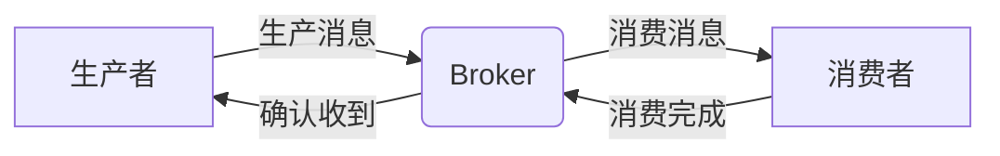

# 源码阅读

### 1. `@LoadBalanced`为什么可以直接通过服务名而非ip发起请求？

1. `org.springframework.http.client.ClientHttpRequestInterceptor`接口会拦截所有的http请求，因此需要实现该接口

2. `org.springframework.cloud.client.loadbalancer.LoadBalancerInterceptor`实现了该接口，其`intercept()`方法如下：

   ```java
   @Override
   public ClientHttpResponse intercept(final HttpRequest request, final byte[] body,
   		final ClientHttpRequestExecution execution) throws IOException {
       // 获取请求的URI
   	final URI originalUri = request.getURI();
       // 从URI解析出主机地址，对于服务来说也就是服务名
   	String serviceName = originalUri.getHost();
   	Assert.state(serviceName != null, "Request URI does not contain a valid hostname: " + originalUri);
       // 生成请求，并根据服务名，调用LoadBalancerClient.execute()方法处理
   	return this.loadBalancer.execute(serviceName, this.requestFactory.createRequest(request, body, execution));
   }
   ```

3. `LoadBalancerClient`是一个接口，具体实现类是`BlockingLoadBalancerClient`。其`execute()`方法如下：

   ```java
   public <T> T execute(String serviceId, LoadBalancerRequest<T> request) throws IOException {
   	String hint = getHint(serviceId);
   	LoadBalancerRequestAdapter<T, TimedRequestContext> lbRequest = new LoadBalancerRequestAdapter<>(request,
   			buildRequestContext(request, hint));
   	Set<LoadBalancerLifecycle> supportedLifecycleProcessors = getSupportedLifecycleProcessors(serviceId);
   	supportedLifecycleProcessors.forEach(lifecycle -> lifecycle.onStart(lbRequest));
       // 根据服务名(Id)为该请求选择一个注册的服务实例。
   	ServiceInstance serviceInstance = choose(serviceId, lbRequest);
   	if (serviceInstance == null) {
   		supportedLifecycleProcessors.forEach(lifecycle -> lifecycle.onComplete(
   				new CompletionContext<>(CompletionContext.Status.DISCARD, lbRequest, new EmptyResponse())));
   		throw new IllegalStateException("No instances available for " + serviceId);
   	}
       // 继续调用重载的execute()方法
   	return execute(serviceId, serviceInstance, lbRequest);
   }
   ```

4. 重载的execute()方法中通过`LoadBalancerRequest.apply()`向服务实例发起执行request的调用。

   ```java
   host@Override
   public <T> T execute(String serviceId, ServiceInstance serviceInstance, LoadBalancerRequest<T> request)
   		throws IOException {
   	// 省略若干代码
   	try {
           // 对服务实例发起调用，获得响应
   		T response = request.apply(serviceInstance);
   		Object clientResponse = getClientResponse(response);
   		supportedLifecycleProcessors
   				.forEach(lifecycle -> lifecycle.onComplete(new CompletionContext<>(CompletionContext.Status.SUCCESS,
   						lbRequest, defaultResponse, clientResponse)));
   		return response;
   	}
       // 省略若干代码
   	return null;
   }
   ```

5. `BlockingLoadBalancerRequest`实现了`LoadBalancerRequest`接口，其`apply()`方法首先构建一个新的请求包装器，然后调用`InterceptingClientHttpRequest.execute()`执行接下来的逻辑

   ```java
   @Override
   public ClientHttpResponse apply(ServiceInstance instance) throws Exception {
       // 对请求进行包装
   	HttpRequest serviceRequest = new ServiceRequestWrapper(clientHttpRequestData.request, instance, loadBalancer);
   	if (this.transformers != null) {
   		for (LoadBalancerRequestTransformer transformer : this.transformers) {
   			serviceRequest = transformer.transformRequest(serviceRequest, instance);
   		}
   	}
   	return clientHttpRequestData.execution.execute(serviceRequest, clientHttpRequestData.body);
   }
   ```

6. `InterceptingClientHttpRequest.execute()`中，主要获得请求方法，请求地址，然后构建并执行请求。

   ```java
   public ClientHttpResponse execute(HttpRequest request, byte[] body) throws IOException {
   	if (this.iterator.hasNext()) {
   		ClientHttpRequestInterceptor nextInterceptor = this.iterator.next();
   		return nextInterceptor.intercept(request, body, this);
   	}
   	else {
   		HttpMethod method = request.getMethod();
           // 获取请求URI，根据URI和方法构建请求
   		ClientHttpRequest delegate = requestFactory.createRequest(request.getURI(), method);
   		request.getHeaders().forEach((key, value) -> delegate.getHeaders().addAll(key, value));
   		if (body.length > 0) {
   			if (delegate instanceof StreamingHttpOutputMessage streamingOutputMessage) {
   				streamingOutputMessage.setBody(outputStream -> StreamUtils.copy(body, outputStream));
   			}
   			else {
   				StreamUtils.copy(body, delegate.getBody());
   			}
   		}
   		return delegate.execute();
   	}
   }
   ```

7. 上一步调用了loadbalancer包里的`ServiceRequestWrapper.getURI()`方法获取URI。该方法内调用`BlockingLoadBalancerClient.reconstructURI()`方法重构URI。

   ```java
   public URI getURI() {
       // 根据服务实例地址重构URI
   	URI uri = this.loadBalancer.reconstructURI(this.instance, getRequest().getURI());
   	return uri;
   }
   ```

8. `BlockingLoadBalancerClient.reconstructURI()`继续调用`LoadBalancerUriTools.reconstructURI()`重构URI。

   ```java
   public URI reconstructURI(ServiceInstance serviceInstance, URI original) {
   	return LoadBalancerUriTools.reconstructURI(serviceInstance, original);
   }
   ```

9. 继续套娃，调用`doReconstructURI()`执行实际的重构过程

   ```java
   public static URI reconstructURI(ServiceInstance serviceInstance, URI original) {
   	if (serviceInstance == null) {
   		throw new IllegalArgumentException("Service Instance cannot be null.");
   	}
   	return doReconstructURI(serviceInstance, original);
   }
   ```

10. `doReconstructURI()`是实际的获取服务实例IP地址，然后据此构建URI的方法。

    ```java
    private static URI doReconstructURI(ServiceInstance serviceInstance, URI original) {
        // 调用服务实例的getHost()方法获取实例地址。
    	String host = serviceInstance.getHost();
    	String scheme = Optional.ofNullable(serviceInstance.getScheme())
    			.orElse(computeScheme(original, serviceInstance));
    	int port = computePort(serviceInstance.getPort(), scheme);
    	if (Objects.equals(host, original.getHost()) && port == original.getPort()
    			&& Objects.equals(scheme, original.getScheme())) {
    		return original;
    	}
    	boolean encoded = containsEncodedParts(original);
    	return UriComponentsBuilder.fromUri(original).scheme(scheme).host(host).port(port).build(encoded).toUri();
    }
    ```

总结：可以看到，这一套逻辑虽然有点绕，但还是比较简单的，核心是在第2、3、10步，第2步解析请求，获得服务名；第3步根据服务名获得服务实例；第10步获得服务实例的地址。于是这就解答了问题，也就是`@LoadBalanced`为什么可以通过服务名发起请求。而如果不声明`@LoadBalanced`，那无法执行这一套逻辑，因此只能根据IP发起请求。

### 2. `@LoadBalancer`怎样实现负载均衡

#### 2.1. 源码

1. [上一个问题](# 4. `@LoadBalanced`为什么可以直接通过服务名而非ip发起请求？)第三步提到了`BlockingLoadBalancerClient.execute()`方法，在这个方法里，调用了`choose()`方法，其逻辑如下：

   ```java
   public <T> ServiceInstance choose(String serviceId, Request<T> request) {
   	ReactiveLoadBalancer<ServiceInstance> loadBalancer = loadBalancerClientFactory.getInstance(serviceId);
   	if (loadBalancer == null) {
   		return null;
   	}
       // 这里选择服务实例，然后构建reactor通信模型
   	Response<ServiceInstance> loadBalancerResponse = Mono.from(loadBalancer.choose(request)).block();
   	if (loadBalancerResponse == null) {
   		return null;
   	}
   	return loadBalancerResponse.getServer();
   }
   ```

2. 上一步调用了`ReactiveLoadBalancer.choose()`方法，`ReactiveLoadBalancer`是一个接口，定义了负载均衡器，`ReactorServiceInstanceLoadBalancer`进一步扩展该接口作为一个标记接口，其实现类有`RandomLoadBalancer`和`RoundRobinLoadBalancer`两个。默认采用的是`RoundRobinLoadBalancer`，也就是轮询。这两个实现类的`choose()`方法完全相同，调用`processInstanceResponse()`，然后在该方法内调用`getInstanceResponse()`实现实际的负载均衡逻辑

   ```java
   public Mono<Response<ServiceInstance>> choose(Request request) {
   	ServiceInstanceListSupplier supplier = serviceInstanceListSupplierProvider
   			.getIfAvailable(NoopServiceInstanceListSupplier::new);
   	return supplier.get(request).next()
   			.map(serviceInstances -> processInstanceResponse(supplier, serviceInstances));
   }
   ```

3. `getInstanceResponse()`实现具体的负载均衡逻辑，其中

   1. 轮询策略实现：

      ```java
      private Response<ServiceInstance> getInstanceResponse(List<ServiceInstance> instances) {
      	if (instances.isEmpty()) {
      		if (log.isWarnEnabled()) {
      			log.warn("No servers available for service: " + serviceId);
      		}
      		return new EmptyResponse();
      	}
      	// Do not move position when there is only 1 instance, especially some suppliers
      	// have already filtered instances
      	if (instances.size() == 1) {
      		return new DefaultResponse(instances.get(0));
      	}
      	// Ignore the sign bit, this allows pos to loop sequentially from 0 to
      	// Integer.MAX_VALUE
          // 用原子变量记录，每次请求都加一
      	int pos = this.position.incrementAndGet() & Integer.MAX_VALUE;
      	ServiceInstance instance = instances.get(pos % instances.size());
      	return new DefaultResponse(instance);
      }
      ```

   2. 随机策略实现：

      ```java
      private Response<ServiceInstance> getInstanceResponse(List<ServiceInstance> instances) {
      	if (instances.isEmpty()) {
      		if (log.isWarnEnabled()) {
      			log.warn("No servers available for service: " + serviceId);
      		}
      		return new EmptyResponse();
      	}
          // 用线程安全的随机数类生成随机索引
      	int index = ThreadLocalRandom.current().nextInt(instances.size());
      	ServiceInstance instance = instances.get(index);
      	return new DefaultResponse(instance);
      }
      ```

#### 2.2. 一个佐证

Feign服务调用带LoadBalanced注解的服务时，如果在调用时没有提供服务的具体地址，只给出了一个服务名，那么会输出如下内容，也就是会使用负载均衡根据服务名选择一个对应的服务实例。

> o.s.c.openfeign.FeignClientFactoryBean   : For 'pay' URL not provided. Will try picking an instance via load-balancing.

# 知识记录

## 1. 消息队列



### 常见问题

#### 1. 消息如何不丢失？

生产者：发送后需要处理Broker的响应，对于失败需要重试发送或报警、记录等

Broker：存储时需要将消息刷盘后再给生产者返回响应，如果有多副本机制还需要写入多个副本后再响应

消费者：执行完成后再返回响应

#### 2. 重复消费的解决方法

重复消费不可避免，只能确保业务执行的幂等。

方法：

1. 数据库唯一键约束
2. 前置条件判断
3. 记录关键key，或者用全局唯一id

#### 3. 推拉设计

生产者到Broker：一般采用推送模式，即生产者将消息推送给Broker。否则生产者需要在本地保存消息等待拉取，不利于保证消息的可靠性。

Broker到消费者：

- 推送模式：Broker推送消息到消费者。
  - 应用：ActiveMQ
  - 优点：消息实时性高、消费者设计简单
  - 缺点：必须从Broker端控制推送速率进而才能适应消费速率。而且不同消费者消费速率不一样进一步增加了控制推送速率的难度
  - 使用场景：消息量小、实时性要求高、消费能力强
- 拉取模式：消费者主动向Broker请求拉取消息。
  - 应用：RocketMQ, Kafka
  - 优点：便于消费者根据自身情况控制消费速率、可以批量拉取、Broker无需考虑消费速率问题。
  - 缺点：需要消费者调整拉取速率（拉取频率太高会影响Broker，太低会导致消息延迟）、在长时间没有消息的时候会导致忙请求空转。

拉取模式的优化：