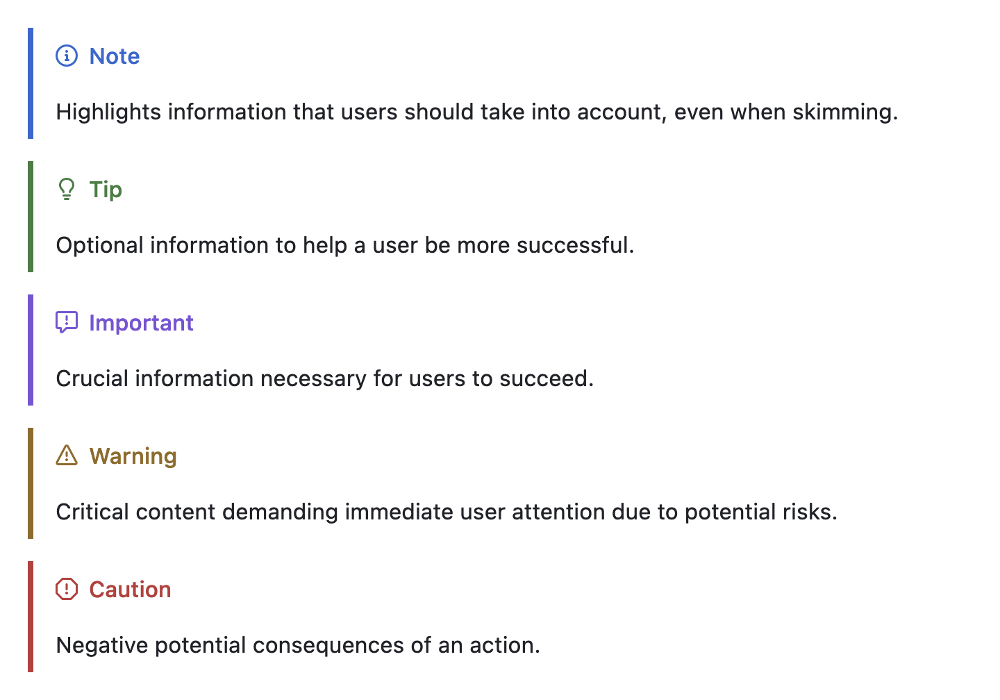

# 说明

各个软件、平台支持的Markdown语法不尽相同，为了尽可能兼容更多的平台，需要尽可能按如下规则撰写。
## GitHub Pages
### 支持
1. 各种内容提醒，如笔记、提示、重要、警告、注意等：`[!NOTE] [!TIP] [!IMPORTTANT] [!WARNING] [！CAUTION]`[^1]，其效果如下图所示：

   

1. 脚注引用，但脚注必须以`[^1]: content`的形式给出，对应的引用形式为`[^1]`，除content左侧外不得出现任何形式的空格。

### 不支持

1. 嵌套括号。形如`[[]]`、`(())`等格式的链接必须以`[\[\]]`、`(\(\))`的形式给出，否则会直接导致后续所有的链接错误或直接无法解析而消失。
1. 图片目录似乎不能以`.`开头，否则会无法显示。

# 参考资料

[^1]: [Basic writing and formatting syntax](https://docs.github.com/en/get-started/writing-on-github/getting-started-with-writing-and-formatting-on-github/basic-writing-and-formatting-syntax)

